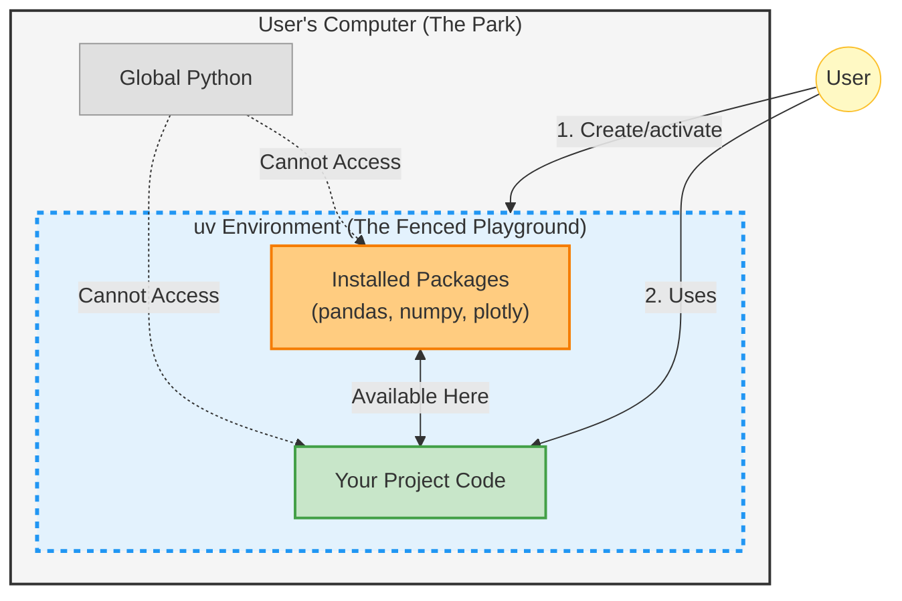
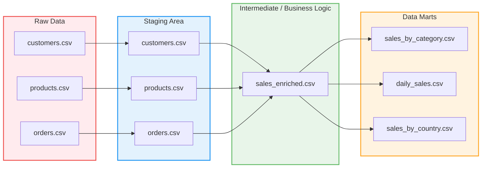

```mermaid
graph TD
    subgraph Computer ["User's Computer (The Park)"]
        style Computer fill:#f5f5f5,stroke:#333,stroke-width:2px
        
        GlobalPy["Global Python"]
        style GlobalPy fill:#e0e0e0,stroke:#999
        
        subgraph UVEnv ["uv Environment (The Fenced Playground)"]
            style UVEnv fill:#e3f2fd,stroke:#2196f3,stroke-width:3px,stroke-dasharray: 5 5
            
            Packages["Installed Packages<br/>(pandas, numpy, plotly)"]
            style Packages fill:#ffcc80,stroke:#f57c00,stroke-width:2px
            
            Project["Your Project Code"]
            style Project fill:#c8e6c9,stroke:#43a047,stroke-width:2px
            
            Packages <-->|Available Here| Project
        end
        
        GlobalPy -.->|Cannot Access| Packages
        GlobalPy -.->|Cannot Access| Project
    end
    
    User((User)) 
    style User fill:#fff9c4,stroke:#fbc02d
    
    User -->|1. Create/activate| UVEnv
    User -->|2. Uses| Project

```

# ETL Pipeline Diagram

```mermaid
graph LR
    subgraph Raw [Raw Data]
        style Raw fill:#ffebee,stroke:#ef5350,stroke-width:2px
        R1[customers.csv]
        R2[products.csv]
        R3[orders.csv]
    end

    subgraph Staging [Staging Area]
        style Staging fill:#e3f2fd,stroke:#2196f3,stroke-width:2px
        S1[customers.csv]
        S2[products.csv]
        S3[orders.csv]
    end

    subgraph Intermediate [Intermediate / Business Logic]
        style Intermediate fill:#e8f5e9,stroke:#66bb6a,stroke-width:2px
        I1[sales_enriched.csv]
    end

    subgraph Marts [Data Marts]
        style Marts fill:#fff3e0,stroke:#ffa726,stroke-width:2px
        M1[sales_by_category.csv]
        M2[daily_sales.csv]
        M3[sales_by_country.csv]
    end

    R1 --> S1
    R2 --> S2
    R3 --> S3

    S1 --> I1
    S2 --> I1
    S3 --> I1

    I1 --> M1
    I1 --> M2
    I1 --> M3
```

